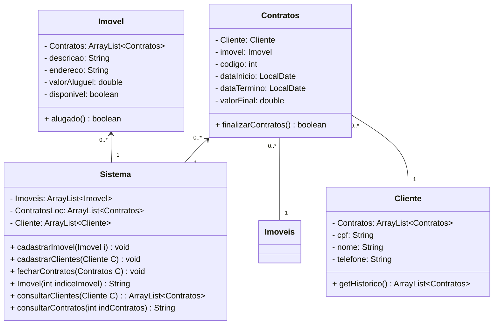

# Diagrama UML para Contratos de locação

```mermaid
classDiagram
    
    Imovel "0..*" <-- "1"  Sistema
    Contratos "0..*" <-- "1" Sistema
    Contratos "0..*" -- "1" Imoveis
    Contratos "0..*" -- "1" Cliente
    
    class Sistema {
        - Imoveis: ArrayList~Imovel~
        - ContratosLoc: ArrayList~Contratos~
        - Cliente: ArrayList~Cliente~
        + cadastrarImovel (Imovel i) void
        + cadastrarClientes (Cliente C) void
        + fecharContratos (Contratos C) void
        + Imovel (int indiceImovel) String
        + consultarClientes(Cliente C): ArrayList~Contratos~
        + consultarContratos (int indContratos) String
    }

    class Contratos {
        - Cliente: Cliente
        - imovel: Imovel 
        - codigo: int 
        - dataInicio: LocalDate 
        - dataTermino: LocalDate 
        - valorFinal: double
        + finalizarContratos() boolean
    }
    
    class Cliente {
        - Contratos: ArrayList~Contratos~
        - cpf: String 
        - nome: String
        - telefone: String 
        + getHistorico() ArrayList~Contratos~
    }
    
    class Imovel {
        - Contratos: ArrayList~Contratos~
        - descricao: String 
        - endereco: String 
        - valorAluguel: double 
        - disponivel: boolean
        + alugado() boolean
    }
```