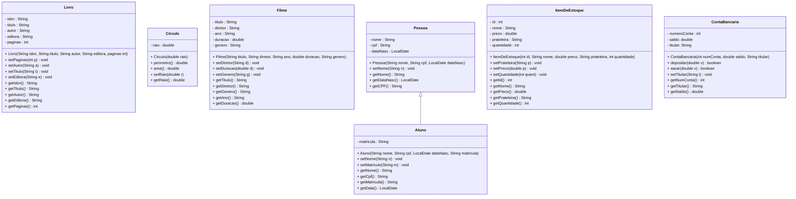

# TADS da atividade 3

```mermaid
classDiagram
    
    class Livro {
        - isbn : String
        - titulo : String
        - autor : String
        - editora : String
        - paginas : int
        + Livro (String isbn, String titulo, String autor, String editora, paginas int)
        + setPaginas(int p) void
        + setAutor(String a) void
        + setTitulo(String t) void
        + setEditora(String e) void
        + getIsbn() String
        + getTitulo() String
        + getAutor() String
        + getEditora() String
        + getPaginas() int   
    }
    
    class Circulo {
        - raio : double
        + Circulo(double raio)
        + perimetro() double
        + area() double
        + setRaio(double r)
        + getRaio() double
    }
    
    class Filme {
        - titulo : String
        - diretor : String
        - ano : String
        - duracao : double
        - genero : String
        + Filme (String titulo, String diretor, String ano, double duracao, String genero)
        + setDiretor(String d) void
        + setDuracao(double d) void
        + setGenero(String g) void
        + getTitulo() String
        + getDiretor() String
        + getGenero() String
        + getAno() String
        + getDuracao() double
    }
    
    class Pessoa {
        - nome : String
        - cpf : String
        - dataNasc : LocalDate
        + Pessoa(String nome, String cpf, LocalDate dataNasc)
        + setNome(String n) void
        + getNome() String
        + getDataNasc() LocalDate
        + getCPF() String  
    }

    Pessoa <|-- Aluno
    
    class Aluno {
        - matricula : String
        + Aluno(String nome, String cpf, LocalDate dataNasc, String matricula)
        + setNome(String n) void
        + setMatriculo(String m) void
        + getNome() String
        + getCpf() String
        + getMatricula() String
        + getData() LocalDate
    }
    
    class ItemDeEstoque {
        - id : int
        - nome : String
        - preco : double
        - prateleira : String
        - quantidade : int
        + ItemDeEstoque(int id, String nome, double preco, String prateleira, int quantidade)
        + setPrateleira(String p) void
        + setPreco(double p) void
        + setQuantidade(int quant) void
        + getId() int
        + getNome() String
        + getPreco() double
        + getPrateleira() String
        + getQuantidade() int
    }
    
    class ContaBancaria {
        - numeroConta : int
        - saldo: double
        - titular: String    
        + ContaBancaria(int numConta, double saldo, String titular)
        + depositar(double v) boolean
        + sacar(double v) boolean
        + setTitular(String t) void
        + getNumConta() int
        + getTitular() String
        + getSaldo() double
    }
```